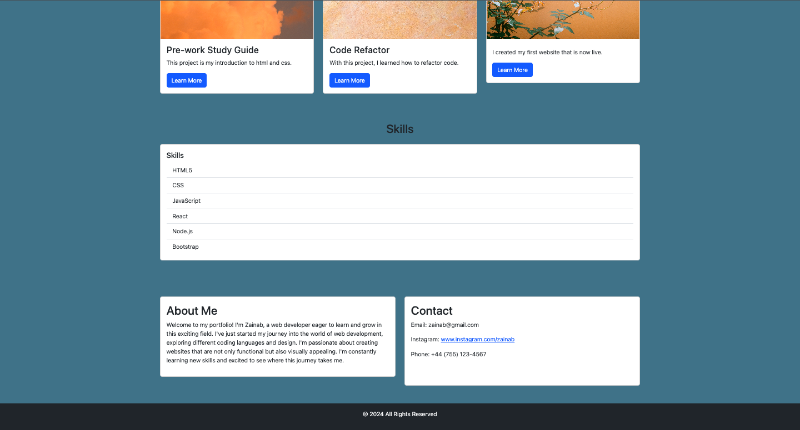

# Bootstrap Portfolio 

## Description: 
This bootstrap portfolio showcases my work as a Wed Developer. It highlights different projects, skills aquired as well as an about me and contact section. 

## Features:
- Nav Bar: You can easily navigate to different sections of the portfolio.
###
- Hero Secretion: Displays my picture, name and position. 
###
- Work Section: Displays projects in a grid layout with brief descriptions and a 'learn more' button that links to the relevant project.
###
- Skills Section: Lists the skills aquired.
###
- About Me/Contact Section: Provides information about me as well as ways to contact me.
###
- Footer: Copyright information.

## Technologies Used:
- HTML
###
- CSS
###
- Bootstrap 

## Screenshot:
The following images show the website:

## Links:
Github: https://github.com/Zai-hub/Bootstrap-Portfolio
Deployment Link: https://zai-hub.github.io/Bootstrap-Portfolio/

## License:
This project is licensed by MIT. 
